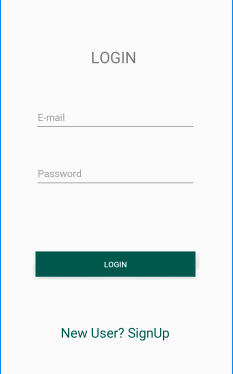
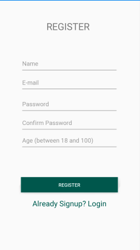
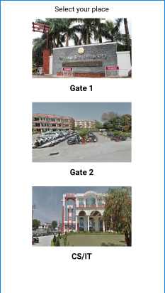
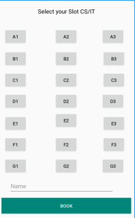
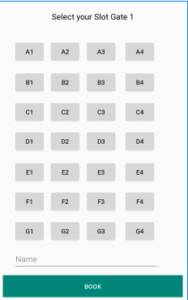
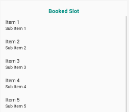
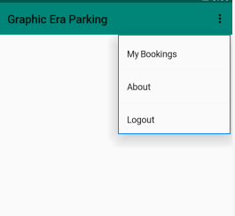
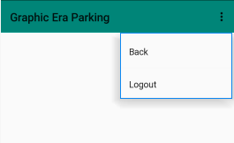
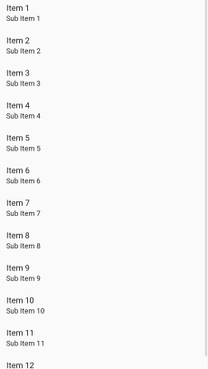

# Parking Android Application
 Basic Parking Android Application with Google Firebase.
 
 >Screenshots

&nbsp; &nbsp; &nbsp;
 
&nbsp; &nbsp; &nbsp;
 
&nbsp; &nbsp; &nbsp;
 
&nbsp; &nbsp; &nbsp;
 

### This application is not published at play store.

## To run it in Android Studio
>1. Open Android Studio
>2. Go to File > Open
>3. Sync Project and Run
